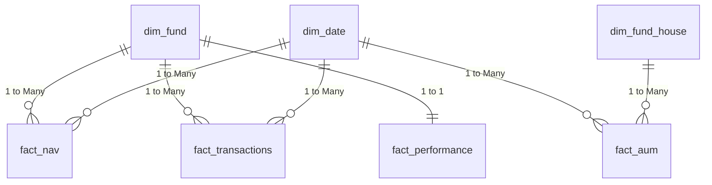

# Data Dictionary: Bluestock Mutual Fund Analytics

This document contains the metadata, schema relationships, and column definitions for the analytical database.

## Star Schema Relationship Diagram

## Table Definitions

### 1. `dim_fund`
**Description:** Static and slowly changing dimensions for mutual fund schemes.
**Source Dataset:** `01_fund_master.csv`

| Column Name | Data Type | Business Definition | Validation Rules |
|-------------|-----------|---------------------|------------------|
| `amfi_code` | INTEGER (PK)| Unique identifier for mutual fund scheme assigned by AMFI. | Must be unique. |
| `fund_house`| TEXT      | Name of the Asset Management Company (AMC). | |
| `scheme_name`| TEXT     | Full name of the mutual fund scheme. | |
| `category`  | TEXT      | Broad classification of the fund (e.g., Equity, Debt). | |
| `sub_category`| TEXT    | Specific classification within the category (e.g., Large Cap). | |
| `plan`      | TEXT      | The type of plan (e.g., Regular, Direct). | |
| `launch_date`| DATE     | Date when the fund was launched. | YYYY-MM-DD format. |
| `benchmark` | TEXT      | The market index against which the fund's performance is compared. | |
| `expense_ratio_pct`| REAL| Annual fee charged by the fund, expressed as a percentage. | |
| `exit_load_pct`| REAL   | Fee charged to investors if they exit the fund early. | |
| `min_sip_amount`| INTEGER| Minimum amount required to start a SIP. | |
| `min_lumpsum_amount`| INTEGER| Minimum amount required for a lump sum investment. | |
| `fund_manager`| TEXT    | Name of the individual managing the fund. | |
| `risk_category`| TEXT   | Risk rating associated with the fund (e.g., Moderate, Very High). | |
| `sebi_category_code`| TEXT| SEBI's regulatory classification code. | |

### 2. `dim_date`
**Description:** Date dimension table for time-based aggregation.
**Source Dataset:** Derived from all datasets containing dates (`nav_history.csv`, `investor_transactions.csv`, `aum_by_fund_house.csv`).

| Column Name | Data Type | Business Definition | Validation Rules |
|-------------|-----------|---------------------|------------------|
| `date_id`   | DATE (PK) | Standardized date key. | YYYY-MM-DD format. |
| `year`      | INTEGER   | Year of the date. | |
| `month`     | INTEGER   | Month of the date (1-12). | |
| `day`       | INTEGER   | Day of the month. | |
| `quarter`   | INTEGER   | Quarter of the year (1-4). | |
| `day_of_week`| INTEGER  | Day of the week (0=Monday). | |
| `is_weekend`| BOOLEAN   | Indicates whether the date falls on a weekend. | |

### 3. `dim_fund_house`
**Description:** Surrogate dimension for fund houses, used primarily for `fact_aum`.
**Source Dataset:** Derived from `03_aum_by_fund_house.csv` and `01_fund_master.csv`.

| Column Name | Data Type | Business Definition | Validation Rules |
|-------------|-----------|---------------------|------------------|
| `fund_house_id` | INTEGER (PK) | Auto-incremented surrogate key. | |
| `fund_house_name` | TEXT | Standardized name of the Asset Management Company. | Must be unique. |

### 4. `fact_nav`
**Description:** Daily Net Asset Value tracking for mutual funds.
**Source Dataset:** `02_nav_history.csv`

| Column Name | Data Type | Business Definition | Validation Rules |
|-------------|-----------|---------------------|------------------|
| `amfi_code` | INTEGER (FK)| Foreign key to `dim_fund`. | |
| `date_id`   | DATE (FK)   | Foreign key to `dim_date`. | |
| `nav`       | REAL        | Net Asset Value per unit on the given date. | Must be > 0. Forward-filled for missing dates in source. |

### 5. `fact_transactions`
**Description:** Individual investor transaction records.
**Source Dataset:** `08_investor_transactions.csv`

| Column Name | Data Type | Business Definition | Validation Rules |
|-------------|-----------|---------------------|------------------|
| `transaction_id`| INTEGER (PK)| Auto-incremented unique transaction identifier. | |
| `investor_id` | TEXT | Unique ID for the investor making the transaction. | |
| `transaction_date`| DATE (FK)| Date the transaction occurred. | YYYY-MM-DD format. |
| `amfi_code` | INTEGER (FK)| Fund in which the transaction occurred. | |
| `transaction_type`| TEXT | Type of investment made. | Standardized to 'SIP', 'Lumpsum', 'Redemption'. |
| `amount_inr` | REAL | Transaction amount in Indian Rupees. | Must be > 0. |
| `state`      | TEXT | State of the investor. | |
| `city`       | TEXT | City of the investor. | |
| `city_tier`  | TEXT | Classification of the city tier (e.g., T30, B30). | |
| `age_group`  | TEXT | Age range of the investor. | |
| `gender`     | TEXT | Gender of the investor. | |
| `annual_income_lakh`| REAL| Investor's annual income in lakhs. | |
| `payment_mode`| TEXT| Method of payment used. | |
| `kyc_status` | TEXT | Investor's Know Your Customer validation status. | Enum: ['Verified', 'Pending']. |

### 6. `fact_performance`
**Description:** Performance, risk, and rating metrics for funds.
**Source Dataset:** `07_scheme_performance.csv`

| Column Name | Data Type | Business Definition | Validation Rules |
|-------------|-----------|---------------------|------------------|
| `amfi_code` | INTEGER (PK/FK)| Foreign key to `dim_fund`. | |
| `return_1yr_pct`| REAL| 1-year trailing return in percentage. | Numeric. |
| `return_3yr_pct`| REAL| 3-year trailing return in percentage. | Numeric. |
| `return_5yr_pct`| REAL| 5-year trailing return in percentage. | Numeric. |
| `benchmark_3yr_pct`| REAL| 3-year trailing return of the fund's benchmark in percentage. | Numeric. |
| `alpha` | REAL | Measure of the active return on an investment compared to a market index. | |
| `beta`  | REAL | Measure of volatility in relation to the market. | |
| `sharpe_ratio`| REAL| Risk-adjusted return measure. | |
| `sortino_ratio`| REAL| Risk-adjusted return measure focusing on downside volatility. | |
| `std_dev_ann_pct`| REAL| Annualized standard deviation of returns. | |
| `max_drawdown_pct`| REAL| Maximum observed loss from a peak to a trough. | |
| `aum_crore` | REAL | Total assets under management for the scheme in crores. | |
| `expense_ratio_pct`| REAL| Annual fee charged by the fund in percentage. | Valid range: 0.1 to 2.5. |
| `morningstar_rating`| INTEGER| Rating given by Morningstar. | |
| `risk_grade`| TEXT | Overall risk grade. | |
| `expense_ratio_anomaly_flag`| BOOLEAN| Flag indicating if the expense ratio falls outside the valid 0.1% - 2.5% range. | |

### 7. `fact_aum`
**Description:** Monthly AUM metrics aggregated at the fund house level.
**Source Dataset:** `03_aum_by_fund_house.csv`

| Column Name | Data Type | Business Definition | Validation Rules |
|-------------|-----------|---------------------|------------------|
| `date_id`   | DATE (FK) | Month-end reporting date. Foreign key to `dim_date`. | |
| `fund_house_id` | INTEGER (FK)| Surrogate key for fund house. Foreign key to `dim_fund_house`. | |
| `aum_lakh_crore`| REAL | Total AUM expressed in lakh crores. | |
| `aum_crore` | REAL | Total AUM expressed in crores. | |
| `num_schemes`| INTEGER | Number of mutual fund schemes managed by the fund house. | |
