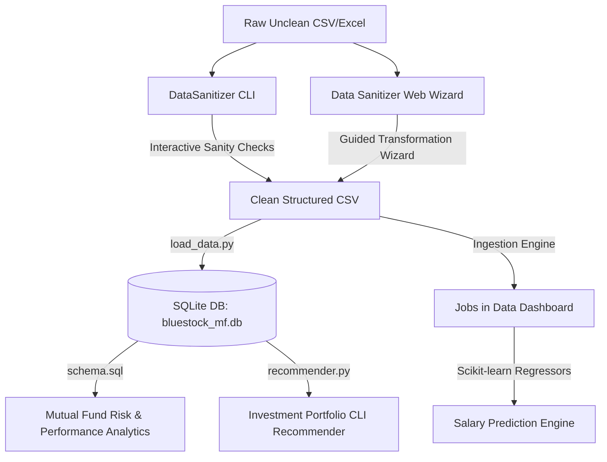

# 📊 Data Analytics & Engineering Workspace

Welcome to the **Data Analytics & Engineering Workspace**—a collection of production-grade analytical platforms, automation agents, risk-modeling portfolios, and market-forecasting engines. This unified workspace brings together command-line interfaces (CLIs), web applications, relational schemas, and machine learning models designed to solve complex data ingestion, sanitization, risk analytics, and salary distribution prediction problems.

[](https://www.python.org/)
[](https://www.sqlite.org/)
[](https://streamlit.io/)
[](https://github.com/Textualize/rich)
[](https://scikit-learn.org/)
[](LICENSE)

---

## 🗺️ Workspace Overview

The workspace is organized into four separate, modular sub-projects. Each directory represents an independent codebase, containing its own local virtual environment configuration, dependency list, and entry points:

```text
data analyst/
├── 🧹 data-agent/                 # Interactive CLI Data Sanitizer & AI Agent
├── 💻 data-clean/                 # Web-based Data Sanitizer Wizard (Streamlit)
├── 📈 Mutual-Fund-Analytics/      # Risk, Performance & SIP Analytics (SQLite + Jupyter)
└── 📊 data-jobs-salary-analysis/  # Salary Trends Dashboard & ML Predictor
```

---

## 🛠️ Architecture & Data Flow

The following diagram illustrates how raw datasets transit through the cleaning wizard engines, load into structured SQL storage, and are served to end-user analytical interfaces and predicting models:



---

## 📦 Project Catalog

### 1. 🧹 DataSanitizer (CLI AI Agent)
An interactive, terminal-based expert data cleaning and analysis agent for CSV, TSV, and Excel files. It scans datasets, classifies anomalies into severity tiers, applies schema-safe cleaning schemes, and hosts both an autocomplete Command-Line Dashboard and an LLM-powered Conversational AI Chat console.

*   **Key Features:**
    *   **Automated Deep Inspection:** Auto-detects missing data, formatting issues, outliers, and schema/type mismatches.
    *   **Safeguarded Sandbox:** Modifies copy datasets only upon explicit permission, preserving raw inputs.
    *   **V2 Autocomplete CLI:** Keyboard-navigable split columns, custom dashboards, and pivot table calculators.
    *   **V3 Conversational AI Mode:** Translates natural language questions to local pandas operations, with key validation and state persistence.
    *   **Pandas Code Exporter:** Outputs exact Python code blocks reproducing the analysis executed in AI Chat.
*   **Tech Stack:** Python, Pandas, OpenPyXL, Rich, Prompt-toolkit, LLM APIs (Gemini, OpenAI, Anthropic).
*   **Key Entry Points:** [main.py](file:///d:/thinkering/data%20analyst/data-agent/main.py) | [README.md](file:///d:/thinkering/data%20analyst/data-agent/README.md)

---

### 2. 💻 Data Sanitizer (Web UI Wizard)
A production-grade, no-code data cleaning platform built on Streamlit. It leverages a guided 4-step wizard interface designed to transform, audit, and export sanitized datasets.

*   **Key Features:**
    *   **Auto-Diagnostics Profiler:** Computes a dataset health score (0-100%) and flags structural issues.
    *   **Confidence-Driven Wizard Cards:** Reviews recommended fixes grouped by confidence rating and severity.
    *   **Cell-Level Before/After Diffs:** High-fidelity comparisons showing exact edits in side-by-side matrices.
    *   **ZIP Audit Export:** Bundles the cleaned output (CSV/Excel) alongside the diagnostics summary and a full operations log.
*   **Tech Stack:** Streamlit, Pandas, NumPy, Zipfile, CSS.
*   **Key Entry Points:** [app.py](file:///d:/thinkering/data%20analyst/data-clean/app.py) | [README.md](file:///d:/thinkering/data%20analyst/data-clean/README.md)

---

### 3. 📈 Mutual Fund Performance Analytics
A database-centric financial analytics platform designed to calculate fund returns, risk scores, performance ratios, and investor SIP portfolios. It loads raw transaction datasets into a optimized SQLite star schema for downstream metric processing.

*   **Key Features:**
    *   **Star Schema Database:** Fully modeled relational schemas mapping fund managers, date dimensions, transactions, and daily NAV benchmarks.
    *   **Risk & Portfolio Modeling:** Calculates CAGR (1Y/3Y/5Y), Sharpe & Sortino ratios, Max Drawdown, Alpha, Beta, Tracking Errors, and VaR/CVaR (95% Value-at-Risk).
    *   **Portfolio Concentration:** Computes Herfindahl-Hirschman Indices (HHI) to classify fund asset diversity.
    *   **SIP Cohort & Continuity:** Tracks cohort behavior over time and categorizes accounts as "Healthy" vs "At-Risk".
    *   **Interactive Recommender:** Terminal utility recommendation scorer matching funds to investor risk grades (Low, Moderate, High, Very High).
*   **Tech Stack:** SQLite, Python, SQLAlchemy, Pandas, SciPy, Matplotlib, Seaborn, Jupyter.
*   **Key Entry Points:** [load_data.py](file:///d:/thinkering/data%20analyst/Mutual-Fund-Analytics/load_data.py) | [recommender.py](file:///d:/thinkering/data%20analyst/Mutual-Fund-Analytics/recommender.py) | [Performance_Analytics.py](file:///d:/thinkering/data%20analyst/Mutual-Fund-Analytics/Performance_Analytics.py) | [schema.sql](file:///d:/thinkering/data%20analyst/Mutual-Fund-Analytics/schema.sql)

---

### 4. 📊 Jobs in Data (Salary & Market Dashboard)
An interactive market-forecasting dashboard analyzing salary patterns across 9,000+ data industry listings. It combines explanatory statistical testing with predictive machine learning models.

*   **Key Features:**
    *   **Macro Market Insights:** Analyzes salary distributions by job role, experience level, remote ratios, and geography.
    *   **Statistical Validation:** Implements SciPy independent t-tests to evaluate remote work salary premiums.
    *   **Predictive Modeling:** Trains Random Forest and Linear Regression models to predict salary from metadata.
    *   **Feature Importance Map:** Dynamically plots which coefficients (location, experience, title) influence salary scales.
*   **Tech Stack:** Streamlit, Pandas, NumPy, Scikit-learn, SciPy, Plotly.
*   **Key Entry Points:** [app.py](file:///d:/thinkering/data%20analyst/data-jobs-salary-analysis/app.py) | [README.md](file:///d:/thinkering/data%20analyst/data-jobs-salary-analysis/README.md)

---

## ⚖️ Cleaning Tool Comparison

This matrix contrasts the design and operational scope of the two data sanitizers included in this workspace:

| Feature | 🧹 DataSanitizer (CLI) | 💻 Data Sanitizer (Web UI) |
| :--- | :--- | :--- |
| **Primary Interface** | Interactive Terminal (Rich / prompt_toolkit) | Browser-based GUI (Streamlit) |
| **Ingestion Formats** | CSV, TSV, XLSX | CSV, XLSX |
| **AI Copilot Mode** | Yes (V3 AI Chat with intent parsing) | No |
| **Operation Log** | Console log only | Downloadable text changelog + ZIP package |
| **Code Exporting** | Exports Pandas syntax of operations | No |
| **Visual Cell Diff** | No | Yes (Side-by-side highlighting) |
| **Execution Steps** | 2-phase scanning and execution | 4-step wizard |

---

## 🚀 Unified Installation & Setup

### 📋 Prerequisites

Ensure you have the following installed on your system:
- **Python 3.9** or **3.10+**
- **pip** (Python package manager)
- **Git** (optional, for cloning)

### ⚙️ Quick Start

Follow these steps to configure your environment and launch the applications:

#### 1. Clone the Workspace
```bash
git clone https://github.com/akhilbehara999/data-analyst.git
cd "data-analyst"
```

#### 2. Run the Interactive CLI Data Agent
```bash
cd data-agent
python -m venv venv
# Windows:
venv\Scripts\activate
# macOS/Linux:
source venv/bin/activate

pip install -r requirements.txt
python main.py sample_data.csv
```

#### 3. Run the Web-based Data Cleaning Wizard
```bash
# Open a new terminal window
cd data-clean
python -m venv venv
# Windows:
venv\Scripts\activate
# macOS/Linux:
source venv/bin/activate

pip install -r requirements.txt
streamlit run app.py
```

#### 4. Run Mutual Fund Analytics & DB Loading
```bash
# Open a new terminal window
cd Mutual-Fund-Analytics
python -m venv venv
# Windows:
venv\Scripts\activate
# macOS/Linux:
source venv/bin/activate

pip install -r requirements.txt

# Ingestion, validation, and analytics calculations
python data_ingestion.py
python Performance_Analytics.py

# Build SQLite DB & load dimension/fact tables
python load_data.py

# Query the CLI Recommender
python recommender.py Moderate
```

#### 5. Run the Jobs & Salary Market Analysis Dashboard
```bash
# Open a new terminal window
cd data-jobs-salary-analysis
python -m venv venv
# Windows:
venv\Scripts\activate
# macOS/Linux:
source venv/bin/activate

pip install -r requirements.txt
streamlit run app.py
```

---

## 👨‍💻 Developer Information

* **Developer:** Pondara Akhil Behara
* **Academic Level:** B.Tech 4th Year Student
* **Department:** Artificial Intelligence & Data Science (AI & DS)
* **Institution:** Chaitanya Engineering College, Kommadi, Visakhapatnam

---

## 📜 License
This workspace is licensed under the MIT License. See the local project subdirectories for full license details.
