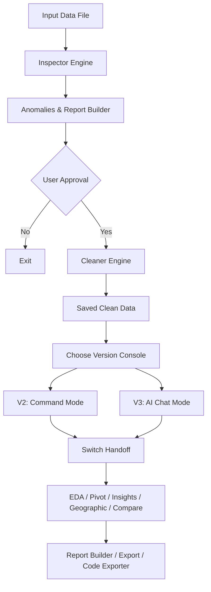

# 🧹 DataSanitizer

[](https://www.python.org/)
[](LICENSE)
[](https://github.com/Textualize/rich)
[](https://github.com/psf/black)

**DataSanitizer** is an interactive, double-phase terminal-based expert data cleaning and analysis agent for CSV, TSV, and Excel files. It scans your datasets, identifies data quality anomalies, proposes an interactive plain-English cleaning scheme, and transitions into a dashboard-driven interactive analysis console.

---

## 🚀 Key Features

* **Phase 1: Automated Deep Inspection** — Detects anomalies across completeness, duplicates, typing mismatch, format consistency, outliers, and structural anomalies.
* **Phase 2: Plain-English Severity Report** — Categorizes findings into `🔴 Critical`, `🟡 Moderate`, `🟢 Minor`, and `⚠️ Outliers` with a detailed step-by-step cleaning outline.
* **Phase 3: Safe Cleaning Sandbox** — Applies sanitization operations strictly upon approval and outputs to a separate file, keeping your raw data safe.
* **V2 Interactive Analysis Console** — A command-line analysis interface featuring a split-column dashboard, slash commands, interactive pivot builder, geographic standardizer, side-by-side comparative analysis, and structured reporting.
* **V3 Conversational AI Chat Mode** — An intelligent natural language console powered by LLMs (Gemini, OpenAI, Anthropic) featuring:
  * **Keyword Intent Parsing**: Automatically maps questions to local V2 analytical operations.
  * **Interactive Config & Key Verification**: Real-time client pings to ensure valid API key storage.
  * **State Persistence & Switch Handoff**: Fluid transitions between V2 and V3 modes without losing context or session history.
  * **Code Exporter**: Extracts exact equivalent Pandas Python code corresponding to the last analysis.

---

## 🛠️ System Architecture

The following diagram represents the end-to-end execution flow of DataSanitizer:



---

## 📦 Supported Detections

| Category | What it Inspects & Sanitizes |
| :--- | :--- |
| **Completeness** | Missing/null/empty values, entirely empty columns, and rows with >50% missing data. |
| **Duplicates** | Exact duplicate rows and duplicate entries in designated unique columns (e.g. IDs, Emails). |
| **Data Types** | Mixed data types, numbers with symbols (`$`, `,`, `%`), plain-text dates, and inconsistent booleans. |
| **Formatting** | Leading/trailing whitespaces, casing discrepancies, and varying date/time styles. |
| **Outliers** | Data points beyond 3σ, negative numbers in positive-only fields, and anomalous future/past dates. |
| **Structural** | Unnamed columns, misplaced header rows, and trailing empty space rows. |

---

## ⚙️ Installation

To install DataSanitizer, clone this repository and install the dependencies:

```bash
# Clone the repository
git clone https://github.com/akhilbehara999/data-agent.git
cd data-agent

# Set up a virtual environment (optional but recommended)
python -m venv venv
source venv/bin/activate  # On Windows: venv\Scripts\activate

# Install requirements
pip install -r requirements.txt
```

---

## 🖥️ Usage

Run the tool using `main.py` and pass the path to your target dataset:

```bash
# General usage
python main.py <path_to_data_file>

# Examples
python main.py sample_data.csv
python main.py data/sales_report.xlsx
```

Once loaded, you will see a detailed quality report and can type `yes` to clean, then select between **[2] V2 Command Mode** or **[3] V3 AI Chat Mode**:

### V2 Command Mode Dashboard
```text
┌─  DataSanitizer v2.0.0  ────────────────────────────────────────────────────┐
│  Welcome to DataSanitizer V2!      │  Tips for getting started              │
│                                    │  • Type / to open autocomplete         │
│          ▟█▙                       │    dropdown                            │
│         ▟███▙  ✦                   │  • Run /help <command> for details     │
│        ▐███◤██▌                    │  ───────────────────────────────────── │
│        ▐██◤  ██▌                   │  Dataset Statistics                    │
│         ▜█◤  █▛                    │  • Shape: 22x11 → 19x9                 │
│                                    │  • Issues Resolved: 21                 │
│  File: sample_data.csv             │  • Actions Applied: 21                 │
│  CWD: /workspace/datasanitizer     │                                        │
└─────────────────────────────────────────────────────────────────────────────┘

  ▎ Session Active · Type a slash command or ask a question
  Commands: /eda · /relationships · /geographic · /pivot · /comparative · /insights · /batch · /report · /export · /reclean · /help
  ─────────────────────────────────────────────────────────────────────────────
  
  ❯ /
```

### V3 Conversational AI Chat Mode Dashboard
```text
┌─  DataSanitizer v3.0.0  ────────────────────────────────────────────────────┐
│  AI Chat Assistant                 │  Dataset Statistics                    │
│                                    │  • Shape: 19x9                         │
│             ▟█▙                    │  • Issues Resolved: 21                 │
│            ▟███▙                   │  • Analyses Run in V2: eda, insights   │
│             ▜██▛                   │                                        │
│  File: sample_data.csv             │                                        │
│  Model: Gemini 2.5 Flash           │                                        │
└─────────────────────────────────────────────────────────────────────────────┘

  ▎ AI Chat Mode Active · Ask a question in plain English or type a slash command
  Commands: /switch · /model · /provider · /config · /export · /code · /help · /exit
  ─────────────────────────────────────────────────────────────────────────────
  
  AI Chat ❯ Calculate the average price per city
```

---

## 💬 Console Commands & Version Scopes

For detailed descriptions of the commands and problems solved by each version, reference the standalone version briefs:
* **[v1.md](v1.md)** — Automated Quality Inspection & Cleaning Engine details.
* **[v2.md](v2.md)** — Offline Interactive Command Console commands (`/eda`, `/relationships`, `/geographic`, `/pivot`, `/comparative`, `/insights`, `/batch`, `/report`, `/export`, `/reclean`).
* **[v3.md](v3.md)** — Conversational AI Chat Mode commands (`/switch`, `/model`, `/provider`, `/config`, `/code`, `/export`).

---

## 📁 Project Structure

```text
data-agent/
├── main.py             # Direct entry point (python main.py <filepath>)
├── requirements.txt    # Managed project dependencies
├── sample_data.csv     # Sandbox demo dataset
├── v1.md               # Version 1 detailed brief
├── v2.md               # Version 2 detailed brief
├── v3.md               # Version 3 detailed brief
├── v1/                 # Data Sanitizer Core (Phase 1-3 Cleaning)
│   ├── __init__.py
│   ├── cli.py          # Phase 1-3 CLI controller & coordinator
│   ├── inspector.py    # Deep Quality Inspection Engine
│   ├── reporter.py     # Rich terminal reporter for findings
│   ├── cleaner.py      # Automated data cleaning sandboxed executor
│   └── models.py       # Shared data models for inspection metrics
├── v2/                 # Interactive Analysis Agent Console (V2)
│   ├── __init__.py
│   ├── agent.py        # V2 interactive session REPL
│   ├── utils.py        # Dashboard renderer, autocomplete & styling helpers
│   ├── session.py      # Stateful logging registry
│   └── commands/       # Slash command implementation modules
└── v3/                 # Conversational AI Chat Mode (V3)
    ├── __init__.py
    ├── agent.py        # V3 interactive conversational assistant
    ├── llm.py          # Unified LLM provider client wrapper
    ├── intent_parser.py # Keyword and rule-based intent router
    ├── narrator.py     # Markdown-based text explanation decorator
    ├── code_exporter.py # Equivalent python script retriever
    ├── memory.py       # Conversational history window buffer
    └── session_bridge.py # Session bridge logic between V2 and V3
```

---

## 🔒 Safety Guarantees

1. **Non-destructive Actions:** The raw input file is never modified or overwritten.
2. **Deterministic Output:** Cleaned results are consistently written to the `output/` directory with detailed timestamps.
3. **Explicit Permissions:** No sanitization operations are performed without user confirmation.
4. **Volume Protection:** Files larger than 100 MB are rejected initially to prevent terminal locks and resource exhaustion.

---

## 📄 License

This project is licensed under the MIT License - see the [LICENSE](LICENSE) file for details.
