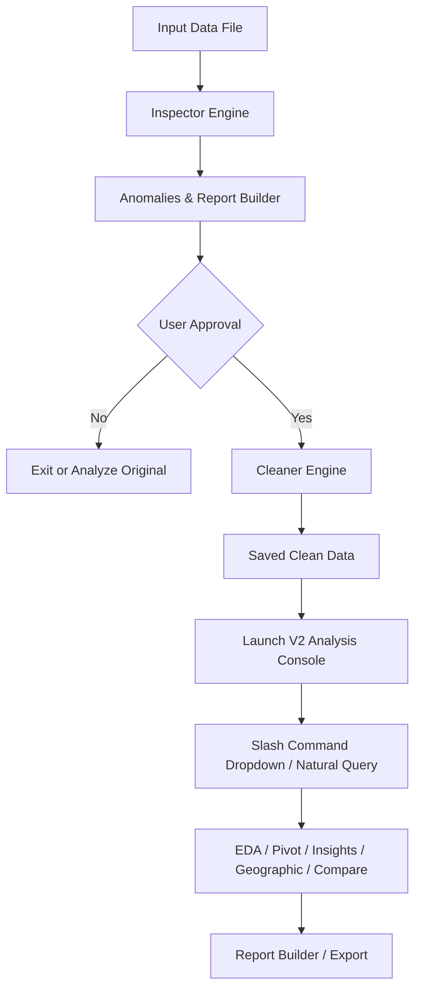

# 🧹 DataSanitizer Tech Brief

If someone asks you **"How did you build this?"**, here is your complete elevator pitch, architectural walkthrough, and technology breakdown.

---

## 💬 The Elevator Pitch (What to say)

> *"I built **DataSanitizer**, a high-performance terminal-based data inspection and analysis CLI in Python. It acts as an interactive cleaning agent that inspects datasets (like CSV and Excel files) for anomalies, automatically cleans them in a safe sandbox without altering the raw files, and then transitions into a full interactive analysis console (inspired by the Claude Code CLI) where you can run auto-EDA, pivot tables, relationship mapping, and Indian geographic analysis using simple slash commands."*

---

## 🛠️ The Tech Stack (What libraries/frameworks were used)

DataSanitizer is built using **Python 3.8+** and utilizes the following libraries:

| Library | Purpose in DataSanitizer |
| :--- | :--- |
| **`pandas`** | The core data processing engine. It handles reading raw data, identifying duplicate/null rows, repairing data types, aggregating pivot tables, and exporting cleaned datasets. |
| **`rich`** | Powers the beautiful visual interface. It renders the modern double-column dashboard, the colored status logs, text formatting, and tabular console reports. |
| **`prompt-toolkit`** | Handles the interactive CLI prompt. It provides the **Slash-Command autocomplete dropdown menu** and the dynamic status footer. |
| **`click`** | Manages the command-line arguments and entry points, making it easy to run `python main.py <filepath>`. |
| **`openpyxl`** | The Excel read/write engine that works under the hood of `pandas` to process `.xlsx` and `.xls` files. |
| **`numpy`** | Used for statistical calculations (like calculating standard deviations to detect 3σ outliers). |
| **`tabulate`** | Used to cleanly format text tables for exports and Markdown reports. |

---

## 📐 Architecture & Workflow (How it runs)

DataSanitizer runs in a **multi-phase execution model**:

### 1️⃣ Phase 1: Automated Deep Inspection (`v1/inspector.py`)
- Reads the dataset (automatically safe-guarding files over 100 MB).
- Performs scans across **6 core categories**:
  * **Completeness**: Missing values, empty columns, and sparse rows (>50% missing).
  * **Duplicates**: Exact row duplicates and unique constraint violations.
  * **Data Types**: Mixed data types (e.g., text and numbers), numeric values with symbols (like `$`, `,`, `%`), and plain-text dates.
  * **Formatting**: Trailing/leading spaces, casing discrepancies, and varying datetime formats.
  * **Outliers**: Values exceeding 3σ (standard deviations) or negative numbers in positive-only fields.
  * **Structural**: Unnamed columns and misplaced headers.

### 2️⃣ Phase 2: Plain-English Findings Report (`v1/reporter.py`)
- Categorizes all anomalies into severity levels: `🔴 Critical`, `🟡 Moderate`, `🟢 Minor`, and `⚠️ Outliers`.
- Writes a detailed human-readable report in Markdown (`output/` directory) and prints a summary layout on screen.

### 3️⃣ Phase 3: Sandboxed Cleaning Engine (`v1/cleaner.py`)
- **Safety Guarantee**: DataSanitizer never overwrites the raw source file.
- It applies appropriate cleaning operations (imputing missing values, removing duplicates, stripping whitespace, parsing datetimes) in memory.
- Writes the cleaned dataset to a timestamped file in the `output/` directory.

### 4️⃣ Phase 4: V2 Stateful Interactive Analysis CLI (`v2/agent.py`)
- Handoffs the cleaned dataset to the stateful CLI session.
- Features a **Claude Code-style double-column dashboard** showing live stats and interactive tips.
- Routes commands via an autocomplete prompt powered by `/` slash commands.
- If a user types a plain English query (e.g. asking about a column), it scans past results (like EDA summaries) to answer them.

---

## 📁 Directory Structure & Code Layout

* **`main.py`**: Entry point coordinates execution.
* **`v1/`** (Data Cleaning Core):
  * `cli.py`: Orchestrates CLI interaction for scanning and cleaning.
  * `inspector.py`: Analyzes files and populates structural issue schemas.
  * `reporter.py`: Handles terminal visuals and exports markdown summary reports.
  * `cleaner.py`: Standardizes column names, drops duplicates, handles null values, and saves outputs.
* **`v2/`** (Interactive Analysis Agent):
  * `agent.py`: Houses the central REPL command router, dashboard layout, and natural language query fallback.
  * `utils.py`: Contains helpers for UI autocompleters, styling, and data type detection.
  * `commands/`: Individual modules for commands:
    * `/eda`: Detailed multi-section exploratory data analysis.
    * `/relationships`: Finding candidate primary keys and numerical correlations.
    * `/geographic`: Clean fuzzy matching on Indian cities/states/regions.
    * `/pivot`: Interactive step-by-step pivot table builder.
    * `/comparative`: Period-over-period or dataset differences.
    * `/insights`: Rule-based scan of 10 different statistical patterns.
    * `/batch`: Loading and merging additional datasets.
    * `/report`: Compilation of findings to HTML and Markdown.
    * `/export`: Exporting to CSV, Excel, Parquet, JSON, and HTML.
